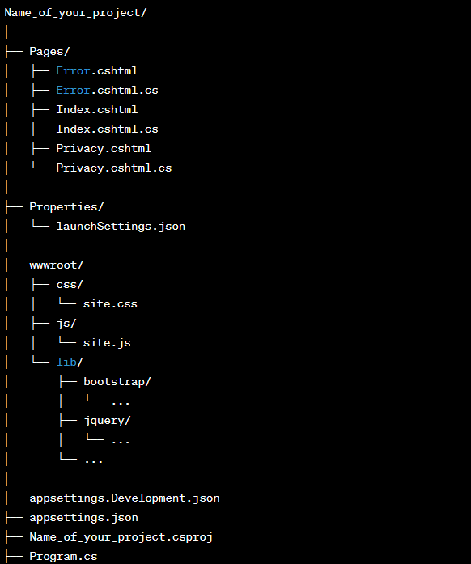

# Setting up a Dotnet Application to serve WebXR

### Install Necessary Dependencies
- To create a dotnet project, you will need the dotnet SDK. You can get the latest version [here](https://dotnet.microsoft.com/en-us/download)
- Once you have installed the dotnet sdk, add it to path and test out a dot net command in your terminal to ensure that is correctly placed within your path. You can type `dotnet --version`.
- It is optional, however, reccomended that you have [Visual Studio](https://visualstudio.microsoft.com/#vs-section) or [Visual Studio Code](https://visualstudio.microsoft.com/#vscode-section) as an IDE to edit your code.

### Creating the ASP Web Framework
Dotnet has various templates that can be used for creating a website. For our purpose, we will create a static webpage. If you do intend on using a database or models, you will likely go with an [MVC](https://dotnet.microsoft.com/en-us/apps/aspnet/mvc) template.

1. Navigate to where you want to start your project. Ensure that you have all of the project files that were built from your webxr project.
2. Once are in the directory where you want to start the asp.net project, type the command `dotnet new webapp -o Name_of_your_project`. Replace the `name_of_your_project` with a descriptive name of your choosing.
3. You should now have a file structure that looks like this:

4. In order to serve the proper headers and configurations for the godot webxr project, we have to add the following to `Program.cs`

    
Click to see code :sparkles:

    using Microsoft.Extensions.Options;
    using Microsoft.AspNetCore.Builder;
    using Microsoft.Extensions.DependencyInjection;
    using Microsoft.AspNetCore.StaticFiles;

    var builder = WebApplication.CreateBuilder(args);

    // Add services to the container.
    // (Add any services you need here, like MVC, Razor Pages, etc.)
    builder.Services.AddRazorPages();

    var app = builder.Build();

    // Configure the HTTP request pipeline.
    if (!app.Environment.IsDevelopment())
    {
        app.UseExceptionHandler("/Error");
        // The default HSTS value is 30 days. You may want to change this for production scenarios, see https://aka.ms/aspnetcore-hsts.
        app.UseHsts();
    }

    app.UseHttpsRedirection();

    // Custom Middleware to set Cross-Origin Isolation headers
    app.Use(async (context, next) =>
    {
        context.Response.Headers.Add("Cross-Origin-Opener-Policy", "same-origin");
        context.Response.Headers.Add("Cross-Origin-Embedder-Policy", "require-corp");
        context.Response.Headers.Add("X-Content-Type-Options", "nosniff");
        await next();
    });

    // Configure MIME type mapping for JavaScript files
    var contentTypeProvider = new FileExtensionContentTypeProvider();
    // contentTypeProvider.Mappings[".js"] = "application/javascript"; // Set the MIME type for .js files
    if (!contentTypeProvider.Mappings.ContainsKey(".pck"))
    {
        contentTypeProvider.Mappings[".pck"] = "application/octet-stream";
    }

    app.UseDefaultFiles(new DefaultFilesOptions
    {
        DefaultFileNames = new List<string> { "index.html" } // Godot project's main HTML file
    });

    app.UseStaticFiles(new StaticFileOptions
    {
        ContentTypeProvider = contentTypeProvider
    });

    app.UseRouting();
    app.UseAuthorization();
    app.MapRazorPages();
    app.Run();

5. Add the following to `appsettings.json`

    
Click to see code :sparkles:

    {
  "Logging": {
    "LogLevel": {
      "Default": "Information",
      "Microsoft.AspNetCore": "Warning",
      "Microsoft.Hosting.Lifetime": "Information"
    }
  },
  "AllowedHosts": "*",
  "Kestrel": {
    "Endpoints": {
      "Https":{
        "Url": "https://localhost:5001"
      }
    }
  }
}

